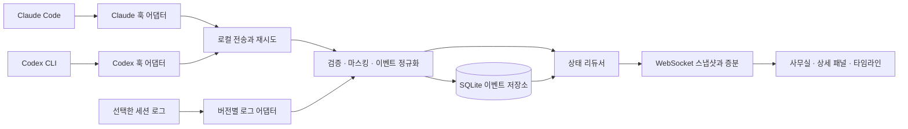

# AI 에이전트 타운 개발계획

> 가칭: Agent Town
> Codex CLI와 Claude Code에서 일하는 AI를 게더 타운 스타일의 2D 픽셀 사무실로 보여주는 로컬 프로그램.
> 조사 기준일: 2026-09-13. 이 문서는 사용자 구상에 대한 조사와 AI의 설계 제안이며, 구현 완료 보고서가 아니다.

## 1. 만들고 싶은 경험

사용자는 평소처럼 터미널에서 Codex CLI 또는 Claude Code를 사용한다. 옆에 열어 둔 사무실 화면에서는 메인 AI가 팀장 캐릭터로 나타난다. 실제로 부하 에이전트를 생성하면 직원 캐릭터가 생기고, 각 직원 위에는 현재 사용하는 도구와 작업 대상이 말풍선으로 표시된다.

예를 들어 사용자가 "로그인 오류를 고치고 테스트해 줘"라고 요청하면 다음과 같은 장면이 보인다.

1. 해당 프로젝트 방의 팀장이 작업 상태로 바뀐다.
2. CLI가 실제로 조사·수정 작업을 위임하면 직원들이 등장한다.
3. 조사 직원은 자료실에서 `Grep · auth`를, 수정 직원은 책상에서 `Edit · login.ts`를 표시한다.
4. 테스트 명령이 실행되면 담당 캐릭터가 실행 구역에서 `Bash · npm test`를 표시한다.
5. 승인이 필요하면 해당 캐릭터에 승인 대기 표시가 남고, 사용자는 원래 CLI에서 처리한다.
6. 작업 결과가 도착하면 완료·실패가 기록되고, 타임라인에서 당시의 에이전트 관계와 도구 호출을 확인한다.

**핵심 가치:** 여러 AI가 누구의 요청으로 무엇을 하고 있으며 어디에서 기다리는지, 로그를 계속 읽지 않고도 파악한다.

위 장면은 제품의 동작 예시다. CLI가 병렬 작업을 선택하지 않은 실행에서는 직원이 임의로 생기지 않는다.

## 2. 조사 결론

**유사 구현은 이미 존재한다.** 특히 Pixel Agents와 Claude Office는 픽셀 사무실, 부하 에이전트, 말풍선이라는 구상에 직접 대응한다. 따라서 이 프로젝트의 개발 가치는 다음에 둔다.

- Codex와 Claude를 같은 화면·같은 상태 체계로 관찰한다.
- 실제 에이전트 관계, 동시 도구 호출, 승인 대기를 정확하게 표시한다.
- Windows에서 설치·연결·종료가 간단하고, 한국어 작업명이 읽기 편하다.
- 실시간 화면과 작업 이력의 근거가 일치하며, 수집이 불완전하면 그 상태도 보여준다.

**개발 제안:** Pixel Agents를 가장 먼저 확장 후보로 평가한다. 1주차에 두 CLI 이벤트를 연결해 보고, 기존 구조를 유지하면서 요구사항을 수용할 수 있으면 그 기반으로 진행한다. 수집 모델이나 라이선스가 걸림돌이면 독립 앱으로 전환한다. 이 판단은 아래 저장소 문서에 근거한 설계 의견이며, 아직 후보를 설치하거나 성능을 비교하지 않았다.

### 조사 범위와 한계

GitHub 저장소의 README, 공개 라이선스 표기, 일부 훅 소스와 양사 공식 문서를 열어 확인했다. 검색어는 `pixel agents Claude Code Codex office visualization`, `claude code gather town agents visualization` 등을 사용했다. 검색 결과의 재게시 글보다 원저장소와 공식 문서를 근거로 삼았다.

저장소를 복제·빌드·실행하지 않았고, 이 PC의 CLI 버전이나 실제 이벤트 페이로드도 검사하지 않았다. 별 수·최근 커밋 수는 품질 판정에 사용하지 않았다. 아래 지원 범위는 조사 시점 공개 문서의 설명이며, 개발 착수 시 사용할 커밋 SHA와 CLI 버전을 고정하고 다시 검증해야 한다.

## 3. GitHub 유사 프로젝트 비교

| 프로젝트 | 공개 자료에서 확인한 내용 | 이 프로젝트에 활용할 점 | 제약과 판단 |
|---|---|---|---|
| [Pixel Agents](https://github.com/pixel-agents-hq/pixel-agents) | VS Code 확장과 독립 브라우저 앱. Claude 캐릭터, 부하 에이전트·팀, 말풍선, 사무실 편집기. 훅과 세션 로그를 이용 | 캐릭터·맵·관찰 UI와 공급자 인터페이스 | README상 Codex는 로드맵. 가장 먼저 확장 가능성을 평가 |
| [Claude Office](https://github.com/paulrobello/claude-office) | 메인 AI를 상사, 부하 AI를 직원으로 표현. 활동 말풍선, 여러 층, 세션 통합 화면 | 사용자가 제안한 상사·직원 연출과 정보 배치 | MIT 표기. 기능 범위가 넓어 작은 MVP에 필요한 부분을 선별 |
| [Office for Claude Agents](https://github.com/percheniy/office-for-claude-agents/blob/main/README_EN.md) | 브라우저 픽셀 사무실. Claude와 기본적인 Codex 지원, 계층·활동·세션 표시 | 여러 CLI와 세션의 공간 배치 | Codex 지원이 기본 수준임을 명시. 세션 포맷 변경에 따른 파서 유지보수 필요 |
| [PixelOffice](https://github.com/KalebKE/PixelOffice) | Claude·Codex 훅을 공통 이벤트로 수신하는 LibGDX 데스크톱 앱. UDP·HTTP 수신 | 공급자별 훅을 동일한 활동 모델로 매핑하는 사례 | Apache-2.0 표기. 웹 기반 후보와 스택이 다르고, 기본 UDP 경로는 전달 보장 없음 |
| [Claude Code Agent Visualizer](https://github.com/tormodt/claude-code-agent-visualizer) | Node 서버가 Claude 로그를 관찰하고 SSE로 전송. 작업 도구와 말풍선, 사무실 테마 | 가벼운 초기 시제품과 표현 방식 | Codex 지원은 확인하지 못함. 확인한 화면에서 라이선스 명시를 찾지 못해 코드 재사용은 보류 |
| [Multi-Agent Observability](https://github.com/disler/claude-code-hooks-multi-agent-observability) | 훅 → HTTP → Bun → SQLite → WebSocket → Vue 구조, 세션·이벤트 필터 | 이벤트 수집·저장·조회 설계 | 공간 UI가 아닌 관측 도구. 확인한 화면에서 라이선스를 확인하지 못해 구조 참고 대상으로 한정 |
| [WorkAdventure](https://github.com/workadventure/workadventure) | 16비트 RPG 형태의 가상 업무 공간과 아바타·근접 대화 | 게더 타운처럼 공간을 이동하고 동료를 인지하는 경험 | AI CLI 관측기는 아님. 가상 협업 플랫폼 전체를 도입하는 것은 초기 범위에 비해 큼. 코드 재사용 조건은 별도 확인 필요 |

### 재사용 방침

Pixel Agents는 공급자 경계와 독립 실행 경로를 갖추고 있고, React·Canvas 2D 기반 구조를 공개한다. 확장한다면 해당 렌더러와 상태 관리 관례를 유지한다. [아키텍처 설명](https://github.com/pixel-agents-hq/pixel-agents#how-it-works)

라이선스 확인은 코드 채택의 선행 작업이다. Pixel Agents의 루트 라이선스는 MIT다. Office for Claude Agents는 upstream MIT 부분과 저자가 별도로 표시한 비상업적 추가분을 구분하므로 저장소 전체를 동일 조건으로 취급하지 않는다. [Pixel Agents LICENSE](https://github.com/pixel-agents-hq/pixel-agents/blob/main/LICENSE), [Office for Claude Agents LICENSE](https://github.com/percheniy/office-for-claude-agents/blob/main/LICENSE)

캐릭터·가구·타일·폰트는 코드와 별도로 출처와 이용 조건을 기록한다. 게더 타운의 공간 경험을 참고하되 로고나 고유 그래픽을 복제하지 않는다. MVP에서는 자체 제작 또는 사용 조건을 확인한 픽셀 스프라이트를 사용한다.

## 4. 무엇을 시각화할 수 있는가

제품에서 말하는 "AI가 내부적으로 하는 일"은 **외부로 관측되는 실행 과정**이다. 비공개 사고 과정이나 모델 내부 계산을 복원하는 기능으로 정의하지 않는다.

| 구분 | 화면에 보여줄 정보 | 표시 원칙 |
|---|---|---|
| 직접 관측 | 도구 이름, 호출 시작·결과, 작업 경로, 에이전트 생성·응답 종료 | 실제 이벤트를 근거로 표시 |
| 조건부 관측 | 상하 관계, 위임 내용, 승인 해소, 사용량, 에이전트 간 메시지 | 해당 실행에서 필드가 제공되고 연결을 확인한 경우만 표시 |
| 제품의 해석 | 책상·자료실 이동, 읽기·코딩 아이콘, 명령의 작업 분류 | 실제 이벤트에 붙이는 시각적 표현. 애니메이션은 업무의 물리적 위치가 아님 |
| 알 수 없음 | 비공개 사고 전문, 이벤트가 없는 구간의 정확한 행동, 근거 없는 진척률 | `상태 미확인`, `수집 제한` 등으로 표시 |

도구 하나를 호출했다고 직원 하나가 생기지는 않는다. **캐릭터는 에이전트에 대응하고, 도구는 말풍선과 행동에 대응한다.** 한 에이전트가 여러 도구를 동시에 실행하면 동일 캐릭터에 진행 중 호출 수를 표시한다.

토큰 수는 제공되는 사용량 이벤트에 근거한다. 구독 사용량을 임의로 금액으로 환산하지 않으며, 비용을 표시하게 되면 공급자 제공 값과 추정 값을 구분한다. MVP의 필수 지표는 실행 시간·활성 도구 수·대기 상태다.

## 5. CLI 연동 전략

### 5.1 권장 실행 형태

첫 버전은 **사용자가 기존 터미널에서 실행하는 CLI를 옆에서 관찰하는 로컬 웹 앱**으로 만든다. 브라우저만으로 CLI 이벤트를 수집할 수는 없으므로 PC에서 수집기를 함께 실행한다. 사용자는 한 번 연결 설정을 끝낸 뒤 평소처럼 CLI를 사용한다.

| 연결 방식 | 용도 | 계획 |
|---|---|---|
| 양사 공식 훅 | 기존 대화형 CLI의 활동 관찰 | 기본 경로 |
| 세션 로그 읽기 | 초기 세션 목록·최근 이력 복원, 훅의 부족한 정보 보완 | 선택 경로. 관측 범위를 제한하고 버전별 파서 사용 |
| 구조화된 CLI 출력 | 앱이 새 작업을 실행하고 출력을 직접 받는 경우 | 후속 실행 모드 또는 검증용 |
| Codex App Server | 앱에서 Codex 대화·승인·작업을 직접 관리하는 경우 | 후속 제어 모드 |

이미 실행 중인 임의의 터미널에 App Server나 `--json` 옵션으로 소급 접속할 수 있다고 가정하지 않는다. 기존 세션은 연결 설정 적용 여부와 수집 가능한 이력에 따라 `실시간`, `이력만`, `연결 필요`로 나눈다.

### 5.2 공식 문서에서 확인한 계약

**Codex:** 현재 문서에 세션·도구·부하 에이전트 훅이 있다. 비관리 훅은 `/hooks`에서 정의를 신뢰해야 실행된다. `SubagentStart`·`SubagentStop`의 `session_id`는 부모 세션이며 `agent_id`로 자식을 구분한다. 로컬 도구는 관찰 가능하지만 hosted `WebSearch`는 도구 훅 대상이 아니다. `exec_command` 종료 결과가 후속 `write_stdin` 시점에 도착할 수 있고, transcript 포맷은 안정 계약이 아니다. 구버전 지원은 별도 검증한다. [Codex Hooks](https://learn.chatgpt.com/docs/hooks)

**Claude Code:** 도구 전후·실패, 세션, 부하 에이전트, 승인 관련 훅을 제공한다. 부하 에이전트 안에서 발생한 훅에는 식별 필드가 제공되며, 종료 훅은 하위 transcript 경로를 포함할 수 있다. `Stop`은 응답 종료이므로 세션 종료와 구분한다. 실제 설치 버전의 필드와 이벤트 누락 조건을 검증해야 한다. [Claude Code Hooks](https://code.claude.com/docs/en/hooks)

**프로그램 실행 경로:** Codex의 `codex exec --json`은 thread·turn·item 이벤트를 JSONL로 출력한다. Claude는 `claude -p "..." --output-format stream-json --verbose --include-partial-messages` 형태의 스트림을 제공한다. 모두 새 실행의 출력을 받는 용도로 검토한다. [Codex Non-interactive Mode](https://learn.chatgpt.com/docs/non-interactive-mode), [Claude Programmatic Execution](https://code.claude.com/docs/en/headless)

**직접 제어 경로:** Codex App Server는 `item/started`, `item/completed` 등과 승인 요청을 제공한다. 이 모드에서는 앱이 클라이언트 역할을 맡으므로 승인 응답·연결 복구·작업 소유권까지 구현해야 한다. 따라서 관찰형 MVP와 별도 단계로 둔다. [Codex App Server](https://learn.chatgpt.com/docs/app-server)

### 5.3 수집기 동작에 대한 설계 결정

1. 훅 설치 전 기존 설정과 추가될 내용을 비교할 수 있게 한다. 설치기는 소유한 항목만 병합·제거하고 백업을 남긴다.
2. 관찰용 훅은 이벤트만 전달한다. 도구 입력 변경, 자동 승인, 모델 컨텍스트 추가는 하지 않는다.
3. 수신기가 꺼져 있어도 CLI 작업은 계속된다. 짧은 전송 제한시간과 크기가 제한된 재전송 대기열을 둔다.
4. 훅별 반환 규약을 검증한다. JSON 응답이 필요한 곳은 빈 객체 등 무동작 응답을 사용하고, 디버그 문자열을 모델 입력으로 흘려보내지 않는다.
5. 훅·로그를 함께 사용할 때 공급자 원본 호출 ID로 중복을 제거한다. 확실하게 대응되지 않으면 합치지 않고 출처를 구분한다.
6. 공식 훅이 없는 구버전은 기본적으로 `연결 필요`를 표시한다. 로그 기반 제한 모드는 사용자가 선택하며 정확도가 낮다는 상태를 유지한다.

PixelOffice의 공개 훅 소스에서도 두 공급자의 도구를 활동 분류로 변환하고 전송 실패가 CLI에 전파되지 않도록 처리하는 구현을 확인했다. 다만 이 제품은 도구 호출별 시작·종료 연결과 전달 복구를 추가로 설계한다. [훅 구현 소스](https://github.com/KalebKE/PixelOffice/blob/main/hooks/pixel_office_hook.py)

### 5.4 연결 상태와 Windows 지원

- 등록된 작업 폴더만 관찰한다. CLI 프로세스 이름만 보고 사용자·프로젝트·세션을 단정하지 않는다.
- 초기 목록은 등록 세션과 허용된 로그 경로에서 만들고, 최근 활동·연결 증거를 별도로 표시한다. 최근 로그가 있다고 실행 중으로 확정하지 않는다.
- Windows 네이티브를 첫 지원 대상으로 삼는다. 공백·한글 경로, UTF-8, PowerShell·CMD, 파일 회전·잠금에 대한 검증을 포함한다.
- WSL은 별도 실행 환경으로 식별한다. 초기에는 수집기와 CLI를 같은 환경에서 실행하며, Windows·WSL 동시 통합은 후속 범위다.
- `hostId`와 실행 환경 ID를 세션 키에 포함한다. 같은 이름의 폴더나 같은 세션 문자열이 다른 환경의 캐릭터와 섞이지 않게 한다.

## 6. 화면과 공간 설계

### 6.1 첫 화면

랜딩 페이지 없이 사무실이 첫 화면이다. 상단에는 프로젝트 선택·CLI 필터·연결 상태가 있고, 왼쪽에는 세션 목록, 중앙에는 픽셀 공간, 오른쪽에는 선택한 에이전트의 현재 작업, 하단에는 이벤트 타임라인을 둔다.

| 화면 영역 | 주요 정보·행동 |
|---|---|
| 세션 목록 | Codex/Claude 표시, 프로젝트, 메인 에이전트, 최근 활동, 연결 상태 |
| 사무실 | 팀장·직원 캐릭터, 책상, 작업 구역, 현재 도구 말풍선 |
| 에이전트 상세 | 역할, 부모, 진행 중 도구, 경과 시간, 마스킹된 인자·결과 |
| 타임라인 | 도구·에이전트·오류 필터, 실시간 따라가기, 일시정지, 이력 재생 |
| 연결 설정 | 수집 상태, 관찰 폴더, 훅 설치 상태, 마지막 수신·오류 |

### 6.2 게더 타운 스타일을 적용하는 방식

첫 맵은 프로젝트 하나당 방 하나로 구성한다. 팀장 책상, 직원 책상, 자료실, 실행 구역, 대기 구역을 배치한다. 사용자는 드래그·확대·축소·캐릭터 선택으로 관찰한다. 직접 걸어 다니는 사용자 아바타와 여러 방을 연결하는 복도는 후속 단계다.

그래픽은 밝은 중립 바탕에 청록·녹색·적색 등 구분되는 포인트 색을 사용한다. 픽셀 그래픽 위에도 한국어 작업명은 읽기 좋은 일반 폰트로 표시한다. 상태는 색뿐 아니라 아이콘과 텍스트로도 구분한다.

팀의 배치는 세션 ID로 안정적으로 결정하고, 이벤트마다 책상을 다시 배정하지 않는다. 이동 애니메이션이 길어도 작업 상태와 말풍선은 즉시 갱신한다. 정보가 빠르게 바뀌면 이동을 단축하거나 생략한다.

### 6.3 캐릭터와 도구 표현

| 실제로 수집한 활동 | 캐릭터 표현 | 말풍선 예시 |
|---|---|---|
| 에이전트 생성·위임 관계 확인 | 직원 등장, 부모와 일시적 연결선 | `조사 담당` |
| 파일 읽기·검색 | 자료실 또는 책상에서 읽기 | `Read · auth.ts` |
| 파일 수정 | 책상에서 입력 | `apply_patch · login.ts` |
| 셸 실행 | 실행 구역에서 작업 | `Bash · npm test` |
| MCP 호출 | 해당 도구 아이콘 | `MCP · browser.navigate` |
| 승인 요청 | 캐릭터 위 고정된 대기 아이콘 | `승인 대기` |
| 도구 실패 | 오류 표시와 상세 링크 | `명령 실패 · exit 1` |
| 응답 종료 | 완료 표시 후 대기 자세 | `응답 완료` |

작업 분류는 정확한 도구명·구조화 필드부터 사용한다. 명령 문자열로 테스트·빌드를 추정하는 규칙은 보조 분류로 둔다. 테스트처럼 보이는 명령이 시작됐다는 이유로 성공을 표시하지 않는다.

### 6.4 말풍선 규칙

- 기본은 `도구명 + 짧은 대상` 2줄, 최대 너비 약 240px. 긴 경로는 파일명으로 축약하고 상세 패널에서 확인한다.
- 짧은 완료 이벤트는 잠시 유지하되 다음 활동·오류·승인 표시를 가리지 않는다. 진행 중 호출은 종료 근거가 올 때까지 상세 목록에 남는다.
- 병렬 호출이 여러 개면 대표 도구와 `+2`처럼 개수를 표시한다. 선택 시 전체 진행 목록을 펼친다.
- 캐릭터가 밀집하면 선택한 캐릭터와 주의가 필요한 상태를 우선 노출한다. 겹치는 말풍선은 숨기고 집계 표시로 대체한다.
- 이름이나 업무 설명이 없으면 중립적인 별칭을 쓴다. 임의로 만든 직무나 대화를 실제 위임 내용처럼 보여주지 않는다.

### 6.5 빈 화면·오류·접근성

세션이 없을 때는 빈 사무실과 연결 상태를 보여준다. 데모는 명확히 구분된 모드로만 실행한다. 연결이 끊기면 마지막 장면은 유지하되 실시간 상태를 해제한다. 키보드로 세션·에이전트를 선택할 수 있는 목록을 제공하고, 이동 효과 축소 옵션을 둔다.

데스크톱에서는 세 영역을 병렬 배치하고, 작은 화면에서는 상세 패널을 접거나 별도 탭으로 전환한다. 화면 크기에 따라 글자를 무작정 축소하지 않는다.

## 7. 시스템 구조

아래는 제품용 논리 구조다. 기존 프로젝트를 확장하는 경우 저장소의 모듈 경계를 따라 배치한다.



### 기술 선택

| 부분 | 우선안 | 선택 이유 |
|---|---|---|
| 앱 형태 | 로컬 서버 + 브라우저 | CLI 사용 유지, 설치 부담 최소화 |
| 언어 | TypeScript | 수집·정규화·UI의 타입 공유 |
| 확장 기반 | Pixel Agents 우선 평가 | 기존 공간 UI와 공급자 경계 활용 |
| UI | 기존 React·Vite 구성 유지 | 검증된 프로젝트 관례와 맞춤 |
| 렌더링 | 확장 시 기존 Canvas 2D 유지 | 엔진 교체에 따른 불필요한 범위 증가 방지 |
| 독립 개발 전환 시 | React + Phaser 후보 | 맵·카메라·캐릭터 애니메이션 중심 구성 |
| 수집 서버 | 기존 서버 유지, 독립 개발 시 Node.js + Fastify | 로컬 HTTP 수집과 WebSocket 상태 전송 |
| 영속화 | SQLite | 세션·이벤트 조회, 재생, 단일 PC 운영 |
| 검증 | Vitest·Playwright | 이벤트 상태 검증과 화면·동작 확인 |

Phaser는 웹용 2D 게임 프레임워크다. PixiJS는 2D 렌더러 후보로 비교할 수 있다. 독립 개발로 전환하면 카메라·타일맵 요구를 포함한 작은 장면으로 비교 후 하나만 채택한다. [Phaser 소개](https://docs.phaser.io/phaser/getting-started/what-is-phaser), [PixiJS 소개](https://pixijs.com/8.x/guides/getting-started/intro)

초기에는 Electron/Tauri 패키징, Redis, 외부 DB, 클라우드 서버가 필요하지 않다. 시각화 상태 분류에는 별도 LLM을 호출하지 않아 추가 추론 비용과 지연을 피한다. 원래 CLI 사용 요금은 해당 서비스의 이용 방식에 따른다.

### 공통 이벤트 모델 초안

다음은 제품 내부 스키마이며 Codex나 Claude의 원본 페이로드가 아니다.

```typescript
type AgentEventKind =
  | "session.started" | "session.ended"
  | "turn.started" | "turn.completed" | "turn.failed"
  | "agent.started" | "agent.response_completed" | "agent.ended"
  | "tool.started" | "tool.completed" | "tool.failed"
  | "approval.requested" | "approval.resolved"
  | "agent.message" | "usage.updated"
  | "source.disconnected" | "source.gap";

interface AgentEvent {
  schemaVersion: 1;
  eventId: string;
  provider: "codex" | "claude";
  providerVersion: string | null;
  adapterVersion: string;
  source: "hook" | "transcript" | "stream" | "app-server";
  sourceEventId: string | null;
  sourceCursor: string | null;
  hostId: string;
  environmentId: string;
  projectId: string;
  sessionId: string;
  turnId: string | null;
  agentId: string | null;
  parentAgentId: string | null;
  toolCallId: string | null;
  occurredAt: string | null;
  receivedAt: string;
  ingestSeq: number;
  kind: AgentEventKind;
  evidence: "observed" | "inferred";
  payload: Record<string, unknown>;
}
```

`payload`는 실제 구현에서 `kind`별로 검증하는 스키마로 분리한다. 도구 시작·종료에는 공급자 도구명, 활동 분류, 마스킹된 대상, 결과 상태를 넣는다. 승인 이벤트에는 요청 ID, 메시지 이벤트에는 발신·수신 식별자와 확인된 텍스트를 넣는다. 제공되지 않는 필드는 생성해 채우지 않는다.

세션 식별자는 `hostId + environmentId + provider + sessionId`, 에이전트 식별자는 여기에 `agentId`를 결합한다. 공급자가 루트 에이전트 ID를 주지 않으면 어댑터가 내부용 루트 ID를 정하고 그 사실을 기록한다. 자식의 식별·부모 연결을 확인하지 못한 이벤트는 미배정 상태로 보관한다.

### 상태 관리와 정확성

에이전트의 상태를 문자열 하나로 덮어쓰지 않는다. 생명주기, 진행 중 도구 집합, 대기 중 승인 집합, 연결 상태를 따로 저장하고 화면에 대표 상태를 계산한다.

| 상황 | 처리 원칙 |
|---|---|
| 여러 도구 동시 실행 | 호출 ID별 추적. 한 호출의 종료가 다른 호출을 끝내지 않음 |
| 응답 종료 | 현재 응답만 완료. 세션 또는 지속형 팀원의 생명주기는 별도 |
| 승인 요청 | 진행 중 도구와 함께 유지. 해결 근거가 없으면 승인 완료를 추정하지 않음 |
| 장시간 이벤트 없음 | `최근 활동 없음` 표시. 실행 종료나 실패로 단정하지 않음 |
| 부모 연결 불명 | 같은 방에 있어도 임의로 상하 관계를 만들지 않음 |
| 중복·재전송 | 전송 eventId와 원본 호출 ID·단계로 멱등 처리 |
| 순서 역전 | 종료 먼저 수신 시 임시 레코드 생성. 나중 시작 이벤트로 완료 상태를 되돌리지 않음 |
| 누락 | `source.gap` 기록. 복구 불가 구간은 타임라인에도 남김 |
| 연결 복구 | 마지막 수신 순번 이후 증분 수신 또는 스냅샷 재동기화 |

독립 훅 프로세스에는 전역 발생 순서를 가정하지 않는다. 수집기가 `ingestSeq`를 부여하고, 원본 시간은 참고값으로 보관한다. 서로 다른 소스의 사건 순서는 호출 연결 관계를 우선한다.

화면 이동·말풍선 지속시간과 실행 상태는 분리한다. 과거 재생은 저장된 순번과 스냅샷을 이용하며, 동일 기록으로 같은 작업 상태를 복원해야 한다. 재생 중에도 실시간 수집은 계속하고 `실시간으로 돌아가기`로 최신 상태에 합류한다.

## 8. MVP 범위

### 반드시 구현할 기능

- Codex와 Claude 각각에 대한 연결 진단과 세션 목록.
- 두 CLI의 세션을 같은 앱에서 표시하고 프로젝트별로 필터링.
- 메인·부하 에이전트 캐릭터와 확인된 부모 관계.
- 도구 이름·대상·진행 상태 말풍선과 병렬 호출 상세 목록.
- 승인 대기·오류·응답 완료·연결 끊김 구분.
- 에이전트 선택, 맵 확대·축소·이동, 목록에서 캐릭터 위치로 이동.
- 이벤트 타임라인, 세션 단위 이력, 기본 일시정지·재생.
- 로컬 저장, 민감정보 마스킹, 설치·해제 시 기존 설정 보존.

### 후속 기능

- 사용자 아바타, 방 사이 이동, 맵 편집, 캐릭터 외형 설정.
- CLI 실행·터미널 연동, 앱 내 승인·입력·중지.
- 에이전트 간 실제 메시지의 전달 애니메이션.
- 토큰·비용 표시, 여러 PC·WSL 통합, 원격 공동 관찰.
- 데스크톱 앱 패키징과 자동 업데이트.

### MVP에서 제외할 것

음성·영상 통화, 사람 간 멀티플레이, 에이전트 자율 편성 엔진, AI 간 강제 업무 분배, 비공개 사고 과정 표시, 정확한 근거가 없는 완료율, 작업마다 LLM으로 말풍선을 생성하는 기능.

## 9. 데이터와 운영

수집기는 기본적으로 loopback에만 바인딩한다. 수집 API와 조회·WebSocket 모두 설치 단위 토큰과 Origin 검증을 적용한다. 웹 페이지가 로컬 포트로 요청을 보낼 수 있다는 전제로 설계하고, 토큰을 URL 쿼리·접근 로그에 남기지 않는다.

원본 전체 프롬프트·파일 내용·도구 결과는 기본 저장 대상에서 제외한다. 필요한 도구명·호출 ID·상태·마스킹된 경로와 요약만 허용 목록으로 추출한다. 비밀값 필터는 훅 송신 전과 영속 저장 전에 적용하고, 사용자 홈 경로는 축약한다. 원문 보관은 별도 선택 설정으로 둔다.

이벤트 데이터는 제품 전용 데이터 디렉터리에 저장하고 개발 저장소에 포함하지 않는다. 초기 보관 기본값은 7일 또는 250MB 중 먼저 도달한 기준으로 제안한다. 이력 삭제·마스킹된 내보내기를 제공하고, 재전송 대기열에도 같은 제한을 적용한다.

공간 UI로부터 명령을 실행하는 API는 관찰형 MVP에 두지 않는다. 나중에 제어 모드를 추가하면 기존 CLI의 승인·권한 체계를 연결하고 작업의 소유권을 명확히 한다.

## 10. 개발 일정과 단계별 완료 조건

**추정:** 1인 개발, 주 5일 집중 작업 기준 6주 내외. 기존 기반의 재사용이 가능한 경우 약 25~30 작업일, 독립 개발 전환이나 CLI 호환성 문제에 1~2주 여유를 둔다. 구현 경험·실제 페이로드에 따라 1주차 종료 시 재산정한다.

| 단계 | 예상 | 작업 | 완료 조건 |
|---|---|---|---|
| 0. 연결·재사용 검증 | 1주차 | 후보 커밋·라이선스 고정, 실제 CLI 버전 확인, 양사 이벤트 샘플 확보 | 두 CLI에서 생성·호출·결과·대기 식별 가능. 확장/독립 개발 결정 기록 |
| 1. 수집·상태 기반 | 2주차 | 어댑터, 스키마, 호출 연결, SQLite, 재전송·복구 | 화면 없이도 저장된 이벤트로 정확한 세션·에이전트·도구 상태 복원 |
| 2. 픽셀 사무실 | 3주차 | 맵, 캐릭터, 이동, 말풍선, 선택 패널 | 실제 이벤트로 두 CLI 캐릭터가 서로 독립적으로 갱신 |
| 3. 병렬·이력 | 4주차 | 부모 관계, 중첩·동시 호출, 승인 대기, 타임라인·재생 | 병렬 시나리오에서 캐릭터·호출 수와 이력이 일치 |
| 4. Windows·장애 대응 | 5주차 | 설치·해제, 한글 경로, 연결 복구, 마스킹, 성능 | 수집기 장애에도 CLI 지속. 설정 보존·누락 표시 검증 |
| 5. 개인 사용 베타 | 6주차 | 실제 작업에 적용, 가독성·오분류 수정, 배포 문서 | 아래 인수 시나리오 통과 및 알려진 제한 기록 |

### 1주차의 의사결정 기준

기존 기반을 확장하는 조건은 두 공급자의 식별자를 손실 없이 수용하고, 도구 동시성·관계·이력을 기존 경계 안에서 추가할 수 있으며, 사용할 코드와 에셋의 조건을 확인하는 것이다. 핵심 상태 모델·렌더러·전송 구조를 모두 교체해야 한다면 독립 개발이 나을 수 있다.

두 CLI 중 하나에서 실제 부하 에이전트 이벤트를 얻지 못했다면 이모티콘이나 가짜 이벤트로 지원 완료를 선언하지 않는다. 지원 가능한 CLI 버전을 정하거나 제한 모드를 명시하고, 양사 지원을 위한 추가 작업을 일정에 반영한다.

## 11. 인수 시나리오와 검증 기준

수치는 구현 후 측정할 목표이며 현재 성능을 의미하지 않는다. 테스트 PC·OS·CLI 버전·후보 커밋·이벤트 파일을 결과에 함께 기록한다.

| 검증 | 합격 기준 |
|---|---|
| 단일 작업 | 양사 각각 읽기·수정·명령 실행의 시작·종료가 호출 ID와 일치 |
| 실제 병렬 위임 | 부모 1명과 실제 생성된 자식 2명 이상이 올바르게 표시. 생성되지 않은 에이전트 0명 |
| 한 에이전트의 병렬 도구 | 3개 중 1개가 끝나도 나머지 2개는 진행 상태 유지 |
| 승인 대기 | CLI 승인 대기 중 화면 표시 유지. 원래 CLI에서 처리 후 근거에 따라 해소 |
| 실패·중단 | 도구 실패·턴 실패·사용자 중단·연결 단절을 성공으로 표시하지 않음 |
| 전달 복구 | 중복·순서 역전·부분 JSONL·재시작·파일 회전 주입 시 상태 손상 없음. 복구 불가 누락은 표시 |
| CLI 영향 | 수집기 강제 종료 시 CLI 작업 지속. 훅 추가 지연 p95 100ms 이하를 초기 목표로 측정 |
| 화면 반영 | 로컬 수집 시각부터 화면 반영까지 p95 500ms 이하 |
| 렌더링 | 20개 캐릭터·초당 50개 이벤트의 합성 부하에서 30fps 이상 목표. 실제 CLI 동시 지원 보장과 구분 |
| 이력 재생 | 동일 이벤트 파일을 재생하면 동일한 에이전트·호출·최종 상태 복원 |
| 설치·해제 | 기존 훅·사용자 설정 유지, 제품 소유 항목만 제거 |
| 정보 보호 | 가짜 API 키·홈 경로를 넣은 테스트에서 UI·DB·로그·내보내기에 원문 비밀값이 남지 않음 |
| 가독성 | 1440×900·1280×720·390×844에서 핵심 컨트롤 접근 가능, 한글 말풍선·패널 겹침 없음 |

어댑터와 리듀서는 실제 샘플을 비식별화한 fixture로 검증한다. UI는 Playwright로 선택·필터·재생·연결 복구를 확인하고 스크린샷 및 캔버스 픽셀 검사로 빈 장면·깨진 에셋·프레임 간 움직임을 점검한다.

MVP 완료는 멋진 데모 영상이 아니라 **실제 Codex와 Claude 작업을 한 번씩 처음부터 끝까지 관찰하고 이력으로 재현하는 것**으로 판단한다.

## 12. 주요 위험과 대응

| 위험 | 대응 |
|---|---|
| CLI 업데이트로 이벤트 포맷 변경 | 지원 버전 범위, 어댑터 버전, fixture 계약 검증. 알 수 없는 이벤트는 진단에 보존 |
| 훅만으로 모든 활동을 보지 못함 | 공급자별 기능 표와 수집 제한 표시. 로그·구조화 스트림 보완은 검증 후 추가 |
| 하위 에이전트의 도구가 부모에게 잘못 귀속됨 | 명시적 ID 연결 우선, 미배정 이벤트 허용, 시간만으로 추정하지 않음 |
| 캐릭터 이동이 실시간 정보를 늦춤 | 실행 상태 우선 갱신, 이동 생략·단축, 밀집 시 집계 |
| 로그가 있어도 실행 중인 것으로 오인 | 이력 존재·최근 활동·연결 증거를 구분 |
| 종료·승인 해소 이벤트 누락 | 미확인 상태와 누락 구간 유지, 임의 성공·임의 퇴근 금지 |
| 기존 도구와 기능이 많이 겹침 | 두 CLI의 일관된 관측·Windows 사용성·정확한 재생에 개발 시간 집중 |
| 후보 코드·에셋 조건 불명확 | 확인된 범위만 재사용하고 대체 에셋 준비 |

## 13. 첫 구현 백로그

아래 항목은 이 계획 이후의 구현 작업이다. 이번 문서 작성 과정에서는 훅 설치나 CLI 설정 변경을 수행하지 않았다.

- [ ] 프로젝트 명칭과 코드 저장소 위치를 정한다. 문서 볼트와 실행 코드·이벤트 DB는 분리한다.
- [ ] Pixel Agents의 후보 커밋을 고정하고 코드·에셋 사용 조건을 기록한다.
- [ ] CLI 실제 버전과 훅 적용·신뢰 상태를 진단하는 명령을 만든다.
- [ ] 각 CLI에서 읽기·수정·명령·위임·대기·실패 샘플을 수집한다.
- [ ] 부모 1명·자식 2명의 실제 병렬 작업에서 ID와 호출 연결을 검증한다.
- [ ] 공통 스키마와 공급자별 기능 지원 표를 확정한다.
- [ ] 수집기 종료·재전송·순서 역전 fixture로 최소 리듀서를 검증한다.
- [ ] 확장 또는 독립 개발 결정을 기록한 후 사무실 UI 구현을 시작한다.

## 14. 미해결 / 더 탐구할 지점

현재 계획의 기본값은 Windows 로컬 관찰형 앱, 기존 Pixel Agents 확장 우선, 한국어 UI다. 다음 사항은 1주차 검증이나 실제 사용으로 결정한다.

- 설치된 두 CLI의 정확한 버전에서 중첩 에이전트와 장시간 도구의 ID 연결이 얼마나 일관적인가?
- Codex의 훅이 포착하지 못하는 활동을 보여주기 위해 선택적 로그 수집이 꼭 필요한가?
- 사용자는 여러 프로젝트 방을 이동하는 경험과 한 사무실에서 모두 보는 경험 중 무엇을 더 자주 쓰는가?
- 장시간 작업에서 캐릭터 이동이 이해를 돕는가, 아니면 책상에 머무르는 편이 편한가?
- 상용 배포를 염두에 둘 것인가? 그렇다면 초기부터 코드·그래픽 재사용 범위를 더 엄격히 정해야 한다.
- 향후 CLI를 이 앱 안에서 실행할 필요가 있는가? 필요하다면 관찰 기능이 안정된 뒤 별도 제어 모드로 설계한다.

## 15. 참고 자료 읽는 순서

빠르게 형태를 파악하려면 [Pixel Agents](https://github.com/pixel-agents-hq/pixel-agents)와 [Claude Office](https://github.com/paulrobello/claude-office)의 화면·기능부터 본다. 양사 수집은 [Codex Hooks](https://learn.chatgpt.com/docs/hooks), [Claude Code Hooks](https://code.claude.com/docs/en/hooks), [PixelOffice 훅 소스](https://github.com/KalebKE/PixelOffice/blob/main/hooks/pixel_office_hook.py)를 대조한다. 저장·전송 구조는 [Multi-Agent Observability](https://github.com/disler/claude-code-hooks-multi-agent-observability), 공간 경험은 [WorkAdventure](https://github.com/workadventure/workadventure)를 참고한다.

공개 문서의 기능 존재와 이 PC에서의 동작 검증은 별개다. 이 계획의 다음 결과물은 실제 이벤트 샘플·지원 범위표·확장 기반 결정 기록이다.

## 16. 1차 구현 및 중단 기록 (2026-09-13)

- 코드 위치: `C:\Users\admin\Desktop\Dev\AgentTown`, 독립 실행 앱은 `town/`.
- 기반: Pixel Agents 커밋 `3537e140c2094761beae748592aeb92ece8edfdd`. 기존 런타임의 단일 공급자 전역 상태 때문에 두 CLI의 동시 관찰은 별도 앱으로 구현하고, MIT 라이선스의 PNG 에셋을 재사용했다. 기존 상위 소스는 수정하지 않았다.
- 역할: Codex가 조사·작업 지시·독립 검증을 감독하고, Claude CLI의 `claude-fable-5-1`이 구현했다. 사용자 요청에 따라 Claude 실행 PowerShell 창을 표시했다.
- 1차 구현: React·Phaser 사무실, 한국어 UI, Claude/Codex 훅 어댑터, 로컬 HTTP/WebSocket 서버, SQLite 저장, 프로젝트별 훅 설치기, 데모·타임라인·이력 기능과 실행 스크립트.
- Claude 자체 검증 보고: 타입 검사·빌드 성공, 단위 테스트 63개와 브라우저 스모크 검사 25개 통과. 실제 CLI 연결은 검증하지 않았다.
- Codex 독립 검증: 데스크톱 1440x960·모바일 390x844에서 렌더링과 캔버스 변화 확인. 초기 화면의 모바일 말풍선·도구막대 배치 문제를 발견했다. 일부 화면 수정 후 전체 재검증은 남아 있다.
- 독립 상태 회귀 테스트: 최종 1차 코드에서 6개 중 1개 통과, 5개 실패. 루트 턴 완료, 늦은 도구 종료 결과, 오래된 중복 시작, 자식별 도구 ID 충돌, 특수 식별자 처리에 수정이 필요하다.
- 독립 서버 입력 검사: 5개 중 1개 통과, 4개 실패. 비정상 URL·소수 조회 제한·WebSocket null 메시지로 서버 종료가 재현됐으며, 정적 파일의 인접 경로 노출도 재현됐다. 실제 사용 전에 수정해야 한다.
- 추가 검토 항목: 보존 기간 경과 후 재구성 일관성, 훅 소유권 식별, 동시 실행 시 재전송 큐의 데이터 손실 방지, 실제 CLI 이벤트 계약 확인.
- 수정 지시서: `AgentTown\supervision\review-task.md`. 최초 구현 로그와 감독용 테스트·스크린샷은 해당 `supervision/`에 있다. 추가 HTTP 검사 스크립트는 이 볼트의 `.agent-town-supervision/supervisor-http.cjs`, 결과는 `AgentTown\supervision\http-check/`에 보관했다.
- 진행 상태: 14:42 KST에 Claude 사용 한도로 검토 실행이 종료됐다. CLI가 안내한 초기화 시각은 같은 날 16:30 KST다. 검토 실행에서는 코드 변경이 이루어지지 않았다. 다른 모델로 자동 전환하지 않았다.
- 다음 조치: 사용자 선택에 따라 Codex 직접 수정 또는 Fable 5.1 재개. 이후 독립 회귀·서버·화면 검사, 실제 Claude 훅 수집 검증, Codex 훅 신뢰 검토와 연결 확인 순서로 진행한다. 현재 상태를 실사용 준비 완료로 간주하지 않는다.

## 17. 후속 구현 및 현재 상태 (2026-09-13)

이 절이 현재 상태이며, 16절은 최초 구현 당시의 이력이다. 이후에도 애플리케이션 코드는 Fable 5.1로 수정했고, 사용자 요청에 따라 최종 독립 검증은 GPT-5.5가 수행했다.

### 구현 및 수정 완료

- 픽셀 사무실 6개, 부모·자식 캐릭터, 도구 말풍선, 승인·실패·대기 상태, 세션·에이전트 상세, 타임라인, 일시정지, 이력 재생, 분리된 데모, 모바일 화면을 구현했다.
- Claude/Codex 훅 어댑터, 로컬 HTTP/WebSocket 수집, SQLite 저장, 비밀값 마스킹, 프로젝트별 훅 설치·제거·백업, 동시 재전송 큐와 보존 정책을 구현했다.
- 최초 상태 회귀 오류 6건과 서버 입력·경로 검사 문제를 수정했다. 서버 입력·경로 독립 검사는 5/5 통과했다.
- 추가로 발견한 오래된 턴 종료 이벤트와 늦은 승인 결과 처리 오류 2건을 수정했다. 최종 GPT-5.5 독립 검증에서 기존 회귀 6/6, 추가 회귀 2/2, 단위 테스트 119/119, 타입 검사가 모두 통과했다.
- 구 checkpoint 호환성 오류를 수정했다. 상태 스키마는 3이며, 기존 데이터는 삭제하지 않고 필요한 필드만 보완한다. SQLite 재시작·재생 일관성과 기존 에이전트·도구·승인·카운터 보존도 검증했다.
- 최종 빌드에서 GPT-5.5가 브라우저 스모크 검사를 다시 실행해 36/36 통과했다. 새 데스크톱·모바일 스크린샷에서도 사무실·캐릭터·말풍선·도구막대의 정상 렌더링을 확인했다. 증거는 `AgentTown\town\smoke-results/`에 있다.

### 실제 CLI 연결 검증

- 실제 Claude CLI에서 `claude-fable-5-1`과 읽기 전용 자식 에이전트 2개를 실행했다. 부모 1명·자식 2명, 완료된 도구 호출 4개, 정상 종료된 세션을 확인했다.
- SessionStart부터 SessionEnd까지 실제 훅 이벤트 16개가 수집됐고, 두 파일의 읽기 결과 Alpha/Beta가 확인됐다. GPT-5.5가 CLI 기록과 수집 이벤트·상태를 교차 검증했다.
- 증거 위치: `C:\Users\admin\Desktop\Dev\AgentTown\supervision\live-check-20260913-215748`.
- 실제 Codex CLI 연결, 특히 자식 에이전트의 도구 연결과 응답 필드 검증은 아직 남아 있다. Codex 어댑터의 가상 이벤트 테스트 통과와 실제 연결 완료를 구분한다. 훅 신뢰 승인은 원래 Codex CLI에서 검토해야 한다.

### 실행 및 남은 범위

- 실행 주소: `http://127.0.0.1:4317`. 앱 코드와 실행 스크립트는 `C:\Users\admin\Desktop\Dev\AgentTown`에 있다.
- 기본 실행 데이터: `C:\Users\admin\.agent-town`. 검사 로그·토큰이 Git에 들어가지 않도록 감독 폴더의 생성 파일을 제외했다.
- 실제 CLI 검사는 격리된 프로젝트에서 수행했으며, 사용자 전역 훅 설정이나 일반 개발 프로젝트에는 훅을 자동 설치하지 않았다. 따라서 최초 앱 화면은 연결된 실제 작업이 없으면 빈 사무실이며, DEMO는 실제 이벤트와 구분된다.
- 미구현·미검증 범위: 실제 Codex 통합, 부하·지연 성능 목표 측정, 토큰·비용 표시, 과거 transcript 수집, Agent Teams, 원격·WSL 연결.
- 현재 결과물은 Windows 로컬 관찰형 MVP다. 전체 6주 계획이나 모든 CLI 조합의 검증이 끝난 것으로 간주하지 않는다.
